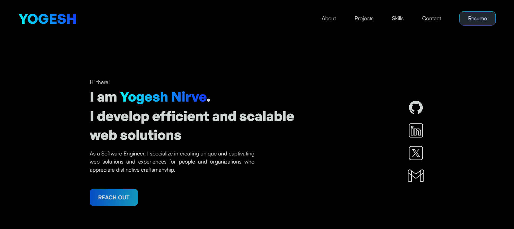
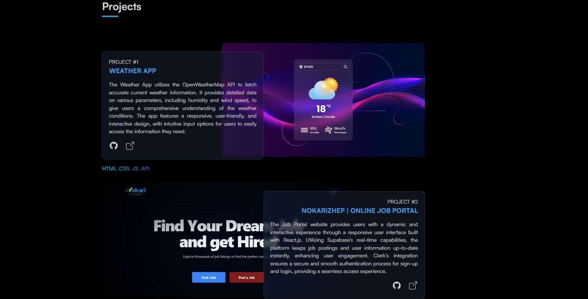
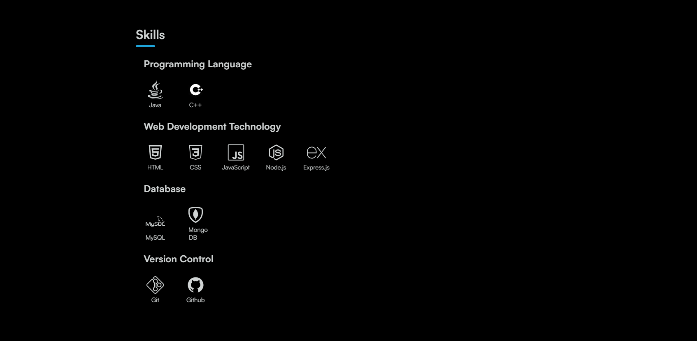

# 🌐 Portfolio Website

A personal portfolio website built using **HTML**, **CSS**, and **JavaScript** to showcase my projects, skills, and contact information.

## 🔗 Live Demo  
👉 [**Check out my Portfolio**](https://yogesh-nirve.vercel.app/)

## Home 


## Projects 


## Skills 



## 🧠 About
This is my personal website where I share my work, experience, and ways to contact me.  
It’s fully responsive and designed to look clean on all devices.

## 🛠️ Tech Used
- HTML  
- CSS  
- JavaScript

## 🚀 How to Run
1. Clone this repo  
   ```bash
   git clone https://github.com/yogesh032003/Portfolio_Website.git
   ```
2. Open the folder  
   ```bash
   cd Portfolio_Website
   ```
3. Run the website  
   Just open **index.html** in your browser.

## 🧩 Folder Structure
```
css/       → Stylesheets  
js/        → JavaScript files  
img/       → Images  
index.html → Main file  
```

## 📬 Contact
If you’d like to connect or collaborate, reach out on  
👉 [LinkedIn](https://www.linkedin.com/in/yogeshsn1/)  
👉 [GitHub](https://github.com/yogesh032003)
